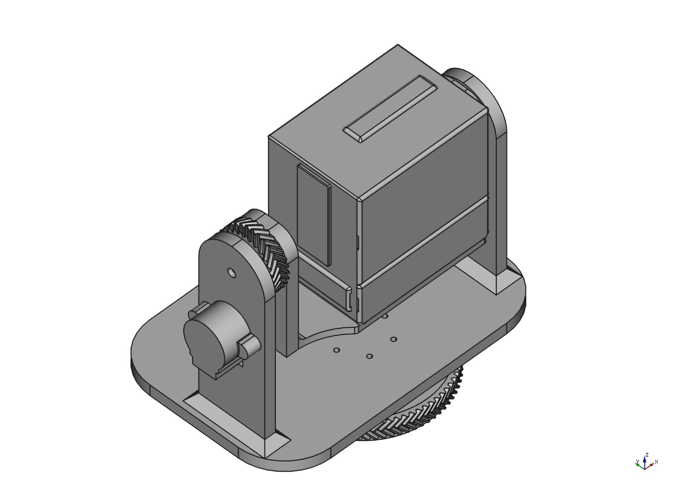

# PT Camera Project

The project aims to provide researchers with a low-cost, open-source pan-tilt (PT) camera system for use in various robotic applications, such as autonomous unmanned aerial vehicle (UAV) landings on unmanned surface vehicles (USVs).

# BoM
| Item Nr. | Product                              | Price (€) | Pieces | Link |
|----------|--------------------------------------|-----------|--------|------|
| 1        | Raspberry Pi 4 Model B 4 GB RAM      | 48.99     | 1      | [Link](https://mou.sr/43gMQWg) |
| 2        | Raspberry Pi 16 MM Lens              | 59.00     | 1      | [Link](https://buyzero.de/en/products/16mm-teleobjektiv-fur-hq-kamera-16mm-telephoto-lens-for-hq-camera) |
| 3        | Raspberry Pi 12 MP HQ Camera         | 52.00     | 1      | [Link](https://www.digikey.de/short/p40hw30b) |
| 4        | Micro-SDHC 32 GB, 120 MB/s           | 5.70      | 1      | [Link](https://www.berrybase.de/sandisk-ultra-microsdhc-a1-120mb-s-class-10-speicherkarte-adapter-32gb) |
| 5        | RB-Moto2 with 28byj-48 Stepper Motors            | 12.52     | 3      | [Link](https://www.reichelt.com/de/en/shop/product/raspberry_pi_-_motor_control_incl_stepper_motors_uln2803apg-176628) |
| 6        | Intenso 7313535 Powerbank 10,000 mAh | 14.49     | 1      | [Link](https://amzn.eu/d/eHD4hbB) |
| 7        | Prusament PETG Filament (1 kg)       | 29.99     | 1      | [Link](https://www.prusa3d.com/de/produkt/prusament-petg-carmine-red-transparent-1kg/) |
| 8        | Charge Cable (C to C)                | 13.84     | 1      | [Link](https://de.rs-online.com/web/p/usb-kabel/2566994?gb=bb) |
| 9        | SKF 623-2Z Deep Groove Ball Bearing  | 4.82      | 2      | [Link](https://motionparts.de/products/623-2z-skf?variant=41904533602466&currency=EUR&utm_medium=product_sync&utm_source=google&utm_content=sag_organic&utm_campaign=sag_organic&gQT=2) |
| 10       | M3 Cylinder Screw                    | 3.50      | 25     | [Link](https://rc-schrauben.de/Zylinderkopfschraube-DIN-912-M3-x-12-Edelstahl-A2) |
| 11       | M3 Hex Nuts                          | 0.43      | 25     | [Link](https://de.farnell.com/en-DE/tr-fastenings/m3-hfst-z100/nut-full-steel-bzp-m3-pk100/dp/1419447) |
| 12       | M3 Washer                            | 0.43      | 25     | [Link](https://de.farnell.com/en-DE/duratool/wash3/washer-steel-m3-pk100/dp/1377496) |
| 13       | M2 Cylinder Screws                   | 1.60      | 8      | [Link](https://rc-schrauben.de/Zylinderkopfschraube-DIN-912-M2-x-8-Stahl-129) |
| 14       | M2 Hex Nuts                          | 1.08      | 4      | [Link](https://rc-schrauben.de/Hexagon-Nut-DIN-934-M2-Stainless-steel) |
|          | **Total Price**                      | **248.11**|        |      |

# Test and Performance Analyses

This part summarizes the experimental results and performance analyses.

---

## Pan and Tilt Performance

### Maximum Angular Speed

| Axis | Theoretical Speed | Measured Avg. Speed | Notes |
|------|-------------------|---------------------|-------|
| Pan  | 31.39°/s          | ~28.83°/s           | Small loss (~8%) |
| Tilt | 48.83°/s          | ~38.69°/s           | Greater loss (~20%) |

- **Cause**: Mechanical design and weight.
- **Solution**: Higher torque motors, lighter construction, step timing optimization.

### Maximum Angular Range

| Axis | Max Angle (Up/Down) |
|------|---------------------|
| Pan  | ±360°               |
| Tilt | -95° to +30°      |

- **Limitation**: Weight and cable strain.

### Combined Motion Execution Time

- **Expected**: 6.34 s
- **Measured**: 7.78 s (~22.7% longer)
- **Reason**: Acceleration delay and stepper lag during combined pan/tilt motion

---

## Object Detection – Free-Fall (Vertical)

| Distance | Detection Rate |
|----------|----------------|
| 0.5 m    | 17.64%         |
| 1 m      | 23.74%         |
| 2 m      | 48.61%         |

- **Test**: HSV-based tracking of a fast-dropping yellow ball.
- **Simulation**: UAV speed during descent (5 m/s).
- **Insight**: Detection improves with distance due to better motion visibility.
- **Needs**:
  - Faster frame rate
  - Reduced exposure time
  - Predictive tracking (Kalman)
  - Real-time lightweight AI models

---

## Object Detection – Oscillation (Lateral)

| Distance | Detection Rate |
|----------|----------------|
| 0.5 m    | 25.05%         |
| 1 m      | 59.05%         |
| 2 m      | 96.41%         |

- **Test**: HSV-based tracking of a laterally oscillating yellow ball.
- **Simulation**: UAV lateral drift (300°/s).
- **Finding**: Excellent performance for lateral motion at long range (2 m).

---

## Latency Analysis

- **Mean latency**: ~93.75 ms
- **Range**: 83.3 – 104.2 ms
- **Impact**: 
  - Camera preview latency measured using 240 fps slow-motion recording.
  - Frame difference used to calculate latency: Latency (ms) = (Δframes / 240) x 1000

**Conclusion**: Sufficient for real-time UAV tracking (<150 ms acceptable limit)

---

## Power Consumption

- 10,000 mAh battery yields **8+ hours** runtime during full tracking operation.
- ~5× better energy efficiency than commercial PTZ systems.
- Modular design allows for easy battery replacement or upgrades.

---

## Maritime Suitability (Sea State)

| Sea State | Status                   |
|-----------|--------------------------|
| SS 0–3    | Stable tracking        |
| SS 4      | Reduced performance    |
| SS 5+     | Not suitable           |

---

## Commercial Comparison

### Advantages
- Modular and open-source
- Low-cost and long battery life
- Reliable object tracking (esp. lateral)
- Weather-resistant housing

### Limitations
- Slower tracking speeds
- Higher weight → suited for static or vehicle-mounted use

---

## Recommended Improvements

- Upgrade to stronger, faster stepper motors
- Redesign cable routing for better tilt range
- Optimize mechanical parts for weight reduction
- Use Jetson Nano/Xavier for real-time AI-based tracking
- Add stereo vision for 3D detection and UAV depth estimation
- Field test in maritime environments

---

📁 GitHub Repository: [erencanbulut/pt_camera_project](https://github.com/erencanbulut/pt_camera_project)
